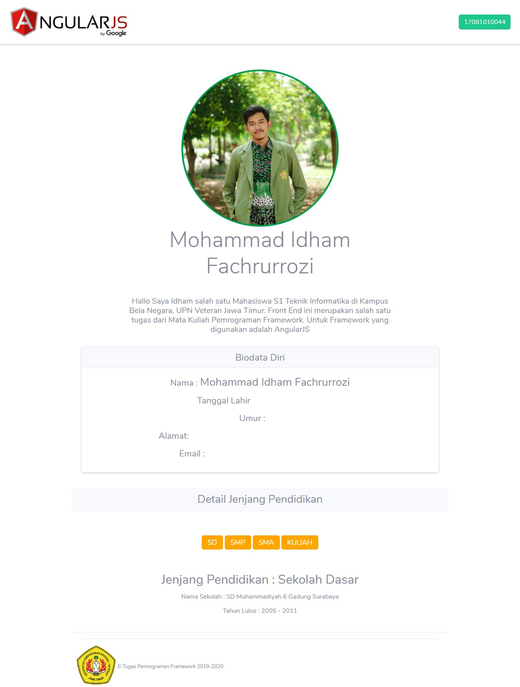
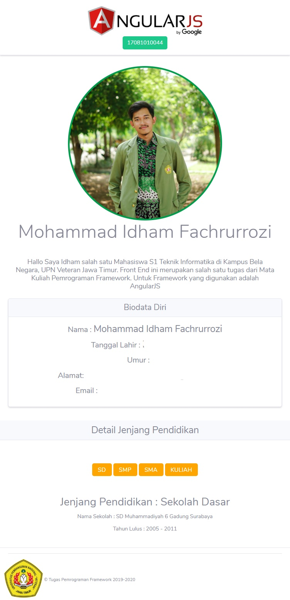

# AngularJs-101
Repositori hasil tugas mata kuliah Pemrograman Framework dalam menggunakan [AngularJs](https://github.com/angular/angular.js), disini saya menggunakan AngularJs versi 1.7.x dengan menggabungkan Bootstrap versi 4. Alasan saya masih menggunakan AngularJs versi lama hanya untuk pengetahuan dan coba-coba aja. Mohon Maaf bila penjelasan saya dibawah ini kurang jelas atau masih kacau.

## Screenshot

### Versi Web


### Versi Mobile
 

## Instalasi AngularJs via Yarn
1. Langkah pertama install terlebih dahulu [npm package manager](https://nodejs.org/en/download/) yang ada dalam Node Js. 
2. Buka Command Prompt
3. Install Yarn (NPM sudah harus terinstall) masukkan command 
```
npm install -g yarn
```
4. Install Angular. File angular yang terinstall otomatis ada di file node_modules.
```
yarn add angular
``` 

## Instalasi Dependencies
1. Pindahkan isi file node_modules ke file project dengan format ```app/lib```.
2. Setelah file sudah di pindahkan ke dalam file ```lib``` maka bisa langsung melakukan instalasi dengan mengarahkan ke direktori file project. Dan memasukkan command
```
npm install
```

## Menjalankan Server
1. Install terlebih dahulu tool Node.js bernama [http-server](https://github.com/indexzero/http-server) yang versi global.
```
sudo npm install -g http-server
```
2. Lalu jalankan server nya dengan memasukkan command 
```
http-server -a localhost -p 8000
```
3. Anda bisa membuka browser dan menuju link 
```
localhost:8000
```
